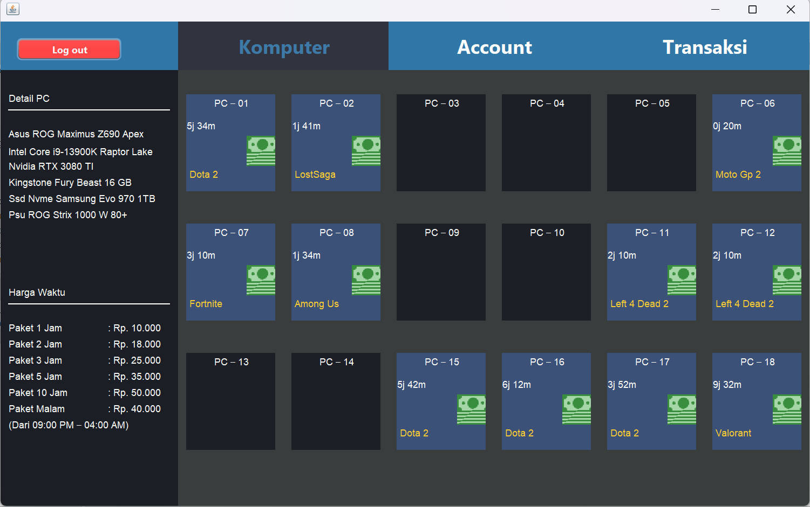
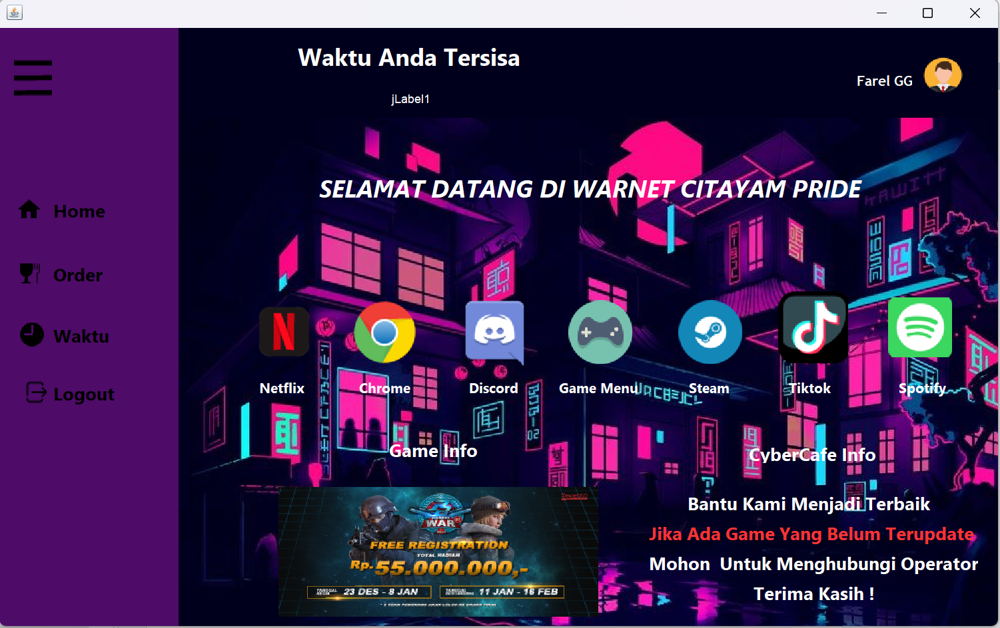

# Application Desktop Warnet Management

 

This project is a Warnet (Internet Cyber Cafe) Management system built in Java. The purpose of this program is to provide an easy-to-use and efficient solution for managing your Warnet Business, including Customer Data, Billing, Order the Foods, Etc.

Whether your warnet is running a small or large, this application simplifies the process of managing daily operations.

## ✨ Features

- 😊 Easy to use for everyone
- ⚙️ Easy to manage
- 🍔 Order Menu
- 🔑 Login and Register Menu
- 💸 Billing System
- 📊 Calculate & Analytics Cash Flow

## 🛠️ Technologies

| Category        | Technologies                                                                                                                                                    |
| --------------- | --------------------------------------------------------------------------------------------------------------------------------------------------------------- |
| **Core**        |                                                                                     |
| **Database**    |   |
| **Development** |                                                         |

## 🖼️ Demo

These are the appearance of Warnet Management System :

### 🛡️ Admin Interface

**Warnet Admin Management Dashboard**

Main Features :

- Management the Computer and the Resources
- Monitoring each Computer
- Daily Transaction
- Management per Price
- Management Account
  

### 👥 Client Interface

**Warnet Client Home Page**

Main Features :

- List Catalog of Games
- Search Game
- Time Remaining
- List Catalog of Food & Beverage
- Payment Integration for FnB (Cash or other Payment Method)

## 🚧 Project Note

> **Academic Project Disclaimer**

> This project implementation was develop for parts of a university assignment. These are several limitations :

- 🧹 Non-optimized code structure
- 📂 Suboptimal project architecture

## 💌 Feedback

If you have any feedback or suggestions, please feel free to share your insights about this project at farelreyhan29@gmail.com
